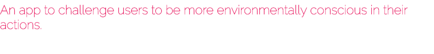
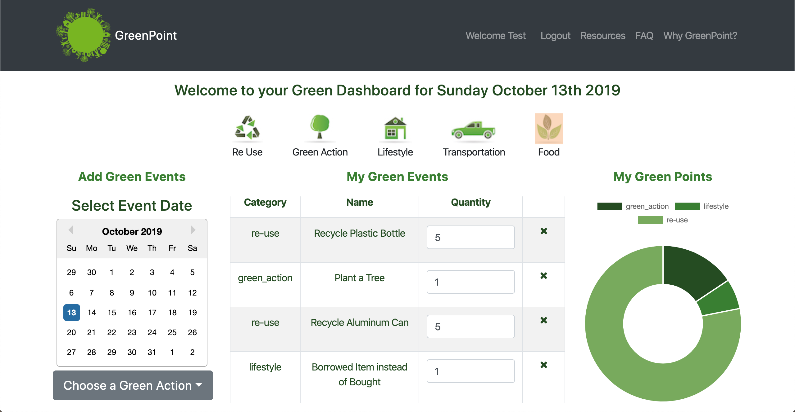
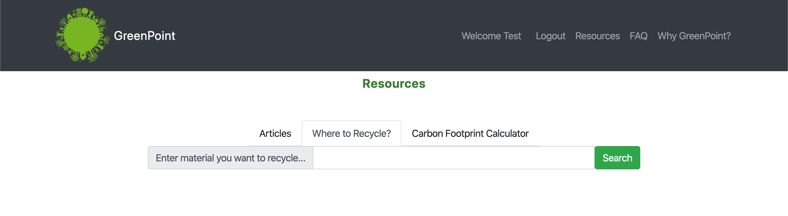

> Greenpoint is an app intended to build awareness around environmentally conscious actions and reward uses through points and community. Ultimately, 

- [x] Implement routes to MongoDB backend for adding and deleting user events

- [x] Utilize JSON web tokens and custom middleware for authentication

- [x] Create dashboard view for users on login

- [x] Add redux for sharing state between adjacent components

- [x] Test code incrementally and manually because we're not crazy enough to write unit tests for each case

- [ ] Allow user to view next and  previous days in dashboard

- [ ] Add support chat

- [ ] Refactor redux store to React Context API

- [ ] Refactor major components to use React Hooks

- [ ] Create apple watch app

> The basic user story is to sign up for an account via the signup form. Upon signup, the user will be logged in and taken to a dashboard view. On the dashboard, they will see the current breakdown of their actions by category, a list of actions to add for that day, and an option to show either the weather or a selection of environmental news articles. There will also be additional resources to show where various materials can be recycled on a map and an advanced carbon footprint calculator.